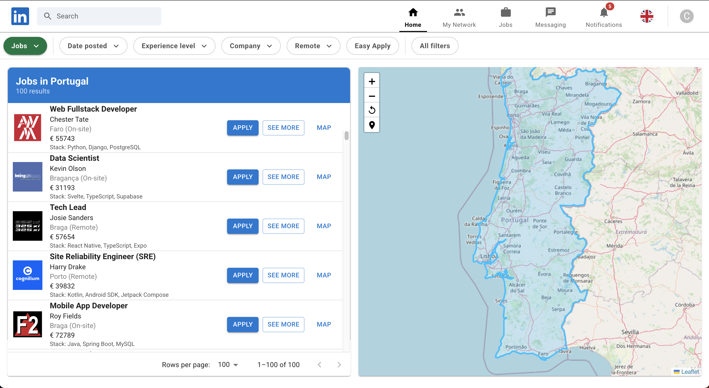

# linkedin
Building a Project with React

# 🧰 Tech Stack

| Technology | Purpose |
|------------|---------|
| React	| Frontend UI framework |
| React-Leaflet | Map engine |
| Leaflet | Geospatial rendering & marker system |
| Material UI | UI components |
| Context API | Global state management |
| CSS | Styling & layout |

# Commands

````

npx create-vite@latest . -- --template react

Select a framework: React
Select a variant: TypeScript
Use rolldown-vite (Experimental)?: No
Install with npm and start now? Yes

-- Router

npm i -S react-router-dom

-- Maps

npm i -S leaflet
npm i -S leaflet-draw
npm i -S react-leaflet@next
npm i -S react-leaflet-cluster
npm i -S react-leaflet-draw

npm i -D prettier eslint-plugin-prettier eslint-config-prettier @typescript-eslint/eslint-plugin @typescript-eslint/parser eslint-plugin-react

Setup package.json

  "scripts": {
    "dev": "vite",
    "build": "tsc -b && vite build",
    "preview": "vite preview",
    "lint": "eslint 'src/**/*.{ts,tsx}'",
    "lint:fix": "eslint 'src/**/*.{ts,tsx}' --fix",
    "format": "prettier --write 'src/**/*.{ts,tsx,js,jsx,json,css,scss,md}'",
    "predeploy": "npm run build",
    "deploy": "gh-pages -d dist"
  },

Copy files from other project
.env
eslint.config.js
.prettierrc
.prettierignore

-- UI

npm i -S @mui/material @emotion/react @emotion/styled 

-- Fonts

npm i -S @fontsource/roboto

import '@fontsource/roboto/300.css';
import '@fontsource/roboto/400.css';
import '@fontsource/roboto/500.css';
import '@fontsource/roboto/700.css';

-- Icons

npm i -S flag-icons @mui/icons-material iconsax-react @iconify/react react-icons

-- Components

@mui/x-date-pickers dayjs @mui/x-data-grid @mui/x-data-grid-generator

-- Deploy

npm i -D gh-pages

npm run predeploy
npm run deploy

-- Run

npm run dev
npm run preview

````

# Web Interface

http://localhost:3000



# Demo

https://devrazec.github.io/linkedin